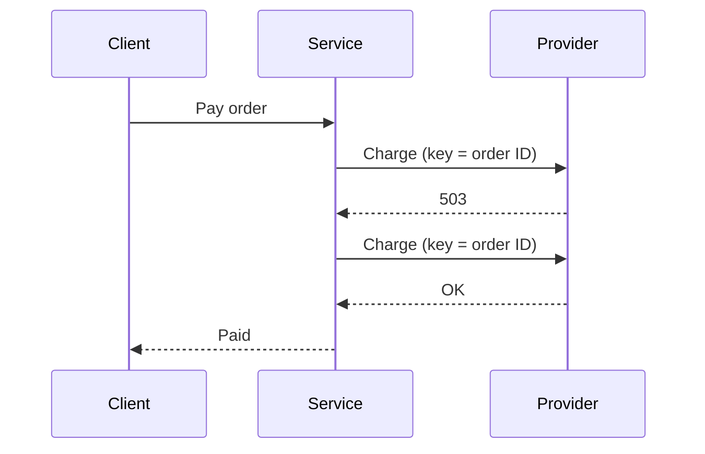

# Payment retries — design

## Context

The payment service retries card payments that fail with a temporary provider error. This
design covers REQ-001 and REQ-002 of the PRD.

## Non-goals

- Retries for bank transfers.
- A queue for payments that fail after every retry.

## Decisions

- **DEC-001:** The payment service owns retries. Rejected: retries in the client, because the
  client cannot see provider errors.
- **DEC-002:** Each attempt sends the order ID as the idempotency key (REQ-002). Rejected: a new
  key for each attempt, because the provider could then charge twice.

## Components

The payment service calls the provider and records each attempt. The checkout service waits
for the result. The API contract is in [the OpenAPI file](assets/payments.openapi.yaml).

## Data model

The payment service owns one table, `payment_attempt`:

| Column | Type | Constraint |
|---|---|---|
| id | uuid | Primary key |
| order_id | uuid | Not null |
| attempt | integer | 1 to 4 |
| outcome | text | ok, timeout, or provider_error |
| created_at | timestamptz | Not null |

## Interfaces

`POST /orders/{orderId}/pay` takes an order ID and returns 200 when the order is paid. It
returns 502 when the provider fails after every retry. The full contract is in the OpenAPI file.

## Retries

The service retries a timeout or an HTTP 503 up to 3 times (REQ-001).

### Backoff

The waits are 200 ms, 400 ms, and 800 ms.

## Failure modes

When the provider is down, each payment fails after 4 attempts, and checkout shows an error.
When the database is down, the service returns 503 and makes no provider call.

## Limits

| Limit | Value |
|---|---|
| Attempts per payment | 4 |
| Timeout per attempt | 10 s |
| Payments per second | 200 |

## Security

Checkout calls the payment service with a service token. The provider key is in the secret
store. The service accepts only order IDs that are UUIDs.

## Testing

A test provider fails once with a 503, and the test expects one charge (REQ-001). A test
provider times out after it charges, and the test expects one charge (REQ-002).

## Open questions

None.
